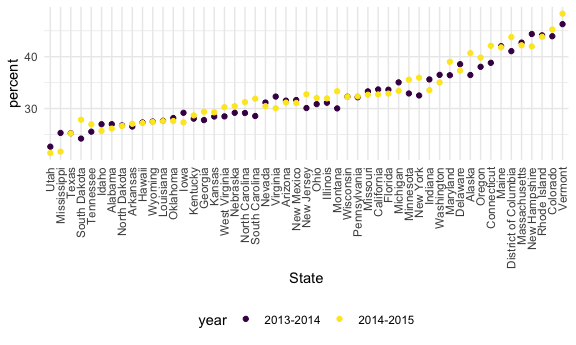
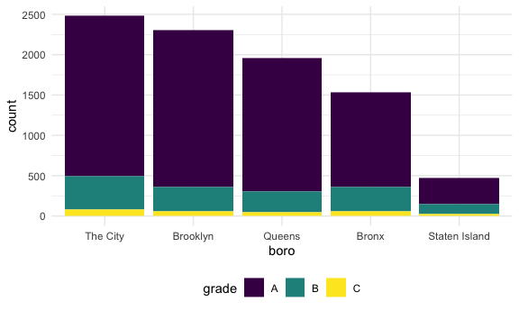

strings_and_facttors
================
Xue Zhang
2023-10-17

``` r
library(tidyverse)
```

    ## ── Attaching core tidyverse packages ──────────────────────── tidyverse 2.0.0 ──
    ## ✔ dplyr     1.1.3     ✔ readr     2.1.4
    ## ✔ forcats   1.0.0     ✔ stringr   1.5.0
    ## ✔ ggplot2   3.4.3     ✔ tibble    3.2.1
    ## ✔ lubridate 1.9.2     ✔ tidyr     1.3.0
    ## ✔ purrr     1.0.2     
    ## ── Conflicts ────────────────────────────────────────── tidyverse_conflicts() ──
    ## ✖ dplyr::filter() masks stats::filter()
    ## ✖ dplyr::lag()    masks stats::lag()
    ## ℹ Use the conflicted package (<http://conflicted.r-lib.org/>) to force all conflicts to become errors

``` r
knitr::opts_chunk$set(
  fig.width = 6,
  fig.asp = .6,
  out.width = "90%"
)

theme_set(theme_minimal() + theme(legend.position = "bottom"))

options(
  ggplot2.continuous.colour = "viridis",
  ggplot2.continuous.fill = "viridis"
)

scale_colour_discrete = scale_colour_viridis_d
scale_fill_discrete = scale_fill_viridis_d
```

``` r
library(rvest)
```

    ## 
    ## Attaching package: 'rvest'

    ## The following object is masked from 'package:readr':
    ## 
    ##     guess_encoding

``` r
library(p8105.datasets)
```

## Strings and manipulations

``` r
string_vec = c("my", "name", "is", "xue")

str_detect(string_vec, "xue")
```

    ## [1] FALSE FALSE FALSE  TRUE

``` r
str_detect(string_vec, "e")
```

    ## [1] FALSE  TRUE FALSE  TRUE

``` r
str_detect(string_vec, "Xue")
```

    ## [1] FALSE FALSE FALSE FALSE

``` r
str_replace(string_vec, "xue", "Xue Zhang")
```

    ## [1] "my"        "name"      "is"        "Xue Zhang"

``` r
string_vec = c(
  "i think we all rule for participating",
  "i think i have been caught",
  "i think this will be quite fun actually",
  "it will be fun, i think"
  )

str_detect(string_vec, "i think")
```

    ## [1] TRUE TRUE TRUE TRUE

``` r
str_detect(string_vec, "^i think") # for the start from "i think"
```

    ## [1]  TRUE  TRUE  TRUE FALSE

``` r
str_detect(string_vec, "i think$") # for the end with "i tthink"
```

    ## [1] FALSE FALSE FALSE  TRUE

``` r
string_vec = c(
  "Time for a Pumpkin Spice Latte!",
  "went to the #pumpkinpatch last weekend",
  "Pumpkin Pie is obviously the best pie",
  "SMASHING PUMPKINS -- LIVE IN CONCERT!!"
  )

str_detect(string_vec,"Pumpkin")
```

    ## [1]  TRUE FALSE  TRUE FALSE

``` r
# either capital or lower case
str_detect(string_vec,"[Pp]umpkin")
```

    ## [1]  TRUE  TRUE  TRUE FALSE

``` r
string_vec = c(
  '7th inning stretch',
  '1st half soon to begin. Texas won the toss.',
  'she is 5 feet 4 inches tall',
  '3AM - cant sleep :('
  )

# anything matches a number 
str_detect(string_vec, "[0-9]")
```

    ## [1] TRUE TRUE TRUE TRUE

``` r
# anything starts with a number
str_detect(string_vec, "^[0-9]")
```

    ## [1]  TRUE  TRUE FALSE  TRUE

``` r
# anything starts with a number and a lower character
str_detect(string_vec, "^[0-9][-z]")
```

    ## [1] FALSE FALSE FALSE FALSE

``` r
str_detect(string_vec, "^[0-9][a-zA-Z]")
```

    ## [1]  TRUE  TRUE FALSE  TRUE

``` r
string_vec = c(
  'Its 7:11 in the evening',
  'want to go to 7-11?',
  'my flight is AA711',
  'NetBios: scanning ip 203.167.114.66'
  )


# "." between "7 and 11" is mean anything can be matched
str_detect(string_vec, "7.11")
```

    ## [1]  TRUE  TRUE FALSE  TRUE

``` r
string_vec = c(
  'The CI is [2, 5]',
  ':-]',
  ':-[',
  'I found the answer on pages [6-7]'
  )


# find anything the brackets exist
str_detect(string_vec, "\\[")
```

    ## [1]  TRUE FALSE  TRUE  TRUE

## Factors

``` r
# "" usually indicates a character
vec_sex = factor(c("male", "male", "female", "female"))
vec_sex
```

    ## [1] male   male   female female
    ## Levels: female male

``` r
as.numeric(vec_sex)
```

    ## [1] 2 2 1 1

``` r
# change the order of "male" and "female"
vec_sex = fct_relevel(vec_sex, "male")
vec_sex
```

    ## [1] male   male   female female
    ## Levels: male female

``` r
as.numeric(vec_sex)
```

    ## [1] 1 1 2 2

## NSDUH

``` r
nsduh_url = "http://samhda.s3-us-gov-west-1.amazonaws.com/s3fs-public/field-uploads/2k15StateFiles/NSDUHsaeShortTermCHG2015.htm"

table_marj = 
  read_html(nsduh_url) |> # read the url
  html_table() |> 
  first() |>
  slice(-1) # remove the first line of the table
```

need to tidy this!

``` r
marj_df =
  table_marj |>
  select(-contains("P Value")) |>
  pivot_longer(
    -State,
    names_to = "age_year",
    values_to = "percent"
    ) |>
  separate(age_year, into = c("age", "year"), "\\(") |>
  mutate(
    year = str_replace(year, "\\)", ""),
    percent = str_replace(percent, "[a-b]", ""),
    percent = as.numeric(percent)) |>
  filter(!(State %in% c("Total U.S.", "Northeast", "Midwest", "South", "West")))
```

``` r
marj_df |>
  filter(age == "18-25") |>
  mutate(State = fct_reorder(State, percent)) |>
  ggplot(aes(x = State, y = percent, color = year)) +
    geom_point() +
    theme(axis.text.x = element_text(angle = 90, vjust = 0.5,  hjust = 1))
```



## NYC Restaurant Inspectitons

``` r
rest_inspec |>
  count(boro, grade) |>
  pivot_wider(
    names_from = grade,
    values_from = n
  ) |>
  knitr::kable()
```

| boro          |     A |     B |    C | Not Yet Graded |   P |    Z |    NA |
|:--------------|------:|------:|-----:|---------------:|----:|-----:|------:|
| BRONX         | 13688 |  2801 |  701 |            200 | 163 |  351 | 16833 |
| BROOKLYN      | 37449 |  6651 | 1684 |            702 | 416 |  977 | 51930 |
| MANHATTAN     | 61608 | 10532 | 2689 |            765 | 508 | 1237 | 80615 |
| Missing       |     4 |    NA |   NA |             NA |  NA |   NA |    13 |
| QUEENS        | 35952 |  6492 | 1593 |            604 | 331 |  913 | 45816 |
| STATEN ISLAND |  5215 |   933 |  207 |             85 |  47 |  149 |  6730 |

``` r
inspection_df =
  rest_inspec |>
  filter(grade %in% c("A", "B", "C"), boro != "Missing") |>
  mutate(
    boro = str_to_title(boro),
    dba = str_to_upper(dba))
```

Pizza places

``` r
inspection_df |>
  filter(str_detect(dba, "PIZZA")) |>
  count(boro)
```

    ## # A tibble: 5 × 2
    ##   boro              n
    ##   <chr>         <int>
    ## 1 Bronx          1531
    ## 2 Brooklyn       2305
    ## 3 Manhattan      2479
    ## 4 Queens         1954
    ## 5 Staten Island   471

``` r
inspection_df |>
  filter(str_detect(dba, "PIZZA")) |>
  mutate(boro = fct_infreq(boro)) |>
  ggplot(aes(x = boro, fill = grade)) +
  geom_bar()
```


``` r
inspection_df |>
  filter(str_detect(dba, "PIZZA")) |>
  mutate(
    boro = fct_infreq(boro),
    boro = fct_recode(boro, "The City" = "Manhattan")) |>
  ggplot(aes(x = boro, fill = grade)) +
  geom_bar()
```


